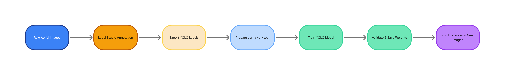

# YOLOv8 Aerial Detector

[](LICENSE) []()

**Professional, reproducible pipeline for Aerial detection using YOLOv8 and Label Studio.**

---

## Contents / Quick links
- **Overview** — what this project is and who it's for.
- **Flowchart** — visual pipeline (see image below).
- **Getting Started** — install, dataset layout, and quick run instructions.
- **Annotation** — Label Studio guidance and conversion to YOLO format.
- **Training** — config and example command lines.
- **Inference & Evaluation** — how to run and export results.
- **Project structure** — files included and purpose.
- **Contributing & Support** — how to contribute and get help.
- **License** — MIT.

---

## Overview

`yolov8-Aerial-detector` is a compact, production-minded repository template to train, evaluate and run inference for Aerial detection on aerial or satellite imagery. It is designed for reproducibility and smooth collaboration between annotators and engineers:

- Annotation: Label Studio for human labeling and QC.
- Conversion: Tools to convert Label Studio exports to YOLO format.
- Training: Config-driven training using Ultralytics' `ultralytics.YOLO` API.
- Inference: Simple inference utilities to visualize and export predictions.

This repository emphasizes clear structure and minimal entry friction for reviewers: a primary notebook for exposition, a small set of configuration files, and an example flowchart for documentation.

---

## Flowchart



*See `flowchart_colored.mmd` for the Mermaid source.*

---

## Getting started (minutes)

### Prerequisites
- Python 3.8+
- GPU recommended for training (NVIDIA + CUDA)
- `git` for cloning the repo

### Install (recommended)
Create a virtual environment and install dependencies:
```bash
python -m venv .venv
source .venv/bin/activate
pip install -r requirements.txt
```

> Tip: For reproducible environments, pin package versions (e.g., `ultralytics==8.x.x`).

### Dataset layout
This repo expects the following layout (local or mounted):
```
data/
  images/
    train/
    val/
    test/
  labels/
    train/
    val/
    test/
```
Each image file must have a corresponding YOLO-format `.txt` label with the same filename stem inside the `labels/<split>/` folder. Example dataset YAML (included as `dataset/ships.yaml`):
```yaml
nc: 1
names: ['Aerial']
train: ../data/images/train
val: ../data/images/val
test: ../data/images/test
```

**Do not commit large image datasets** to GitHub. Use cloud storage (S3, GDrive) and document download instructions in the README.

---

## Annotation with Label Studio

1. Create a Label Studio project and import images.
2. Use the provided `labelstudio_config.xml` (or configure bounding-box tool with a single label `ship`).
3. Annotate and run reviewer passes for quality control.
4. Export annotations as JSON and convert to YOLO format using `tools/ls_to_yolo.py` (adapt converter to your export schema).

A small conversion script is included as a stub — adapt it to your Label Studio output schema before running at scale.

---

## Training

### Configuration
- `configs/` contains sample YOLO config files (e.g., `yolov8n.yaml`).
- `dataset/ships.yaml` is the dataset descriptor that points to image folders and class names.
- Use `train.py` (if present) or the Ultralytics CLI/API directly.

### Example command
```bash
python train.py --config configs/yolov8n.yaml --data dataset/ships.yaml --epochs 50 --batch 16 --save-dir runs/exp
```
Or programmatically:
```python
from train import train_model
train_model("configs/yolov8n.yaml", "dataset/ships.yaml", epochs=50, batch_size=16, seed=42, save_dir="runs/exp")
```

### Tips for reproducible training
- Set `seed` for deterministic behavior where possible.
- Log hyperparameters and dataset manifest to `save_dir`.
- Use small runs (1–5 epochs) for smoke tests before full training.
- Save best checkpoints and a copy of `dataset/ships.yaml` with each run for provenance.

---

## Inference & Evaluation

Use `inference.py` to run models on new images and save visualizations:
```bash
python inference.py --weights runs/exp/weights/best.pt --source data/test/images --output predictions/
```

For evaluation, compute standard object-detection metrics: mAP@0.5 and mAP@[0.5:0.95]. Ultralytics provides built-in evaluation or export predictions to CSV/JSON for external scoring pipelines.

---

## Repository structure (minimal)

```
yolov8-ship-detector/
├─ ADD_YOUR_NOTEBOOK.ipynb    # Main notebook: replace with your .ipynb
├─ README.md                  # <-- this file (professional)
├─ requirements.txt
├─ dataset/ships.yaml
├─ flowchart_colored.mmd
├─ flowchart_colored.png
├─ tools/ls_to_yolo.py        # converter stub (adapt to your export schema)
├─ LICENSE
└─ .gitignore
```

---

## Contributing

We welcome contributions. Suggested workflow:
1. Fork the repository and create a feature branch.
2. Run tests and linters locally (`pytest`, `black`, `flake8`).
3. Open a descriptive Pull Request; include screenshots or logs if training/inference changes are included.
4. Keep commit messages focused and atomic.

See `CONTRIBUTING.md` for more detailed guidelines (if present).

---

## License

This project is released under the **MIT License** — see `LICENSE` for details.

---

## Contact & Support

For questions or feature requests, open an issue in the repository or contact the repository owner.

---
